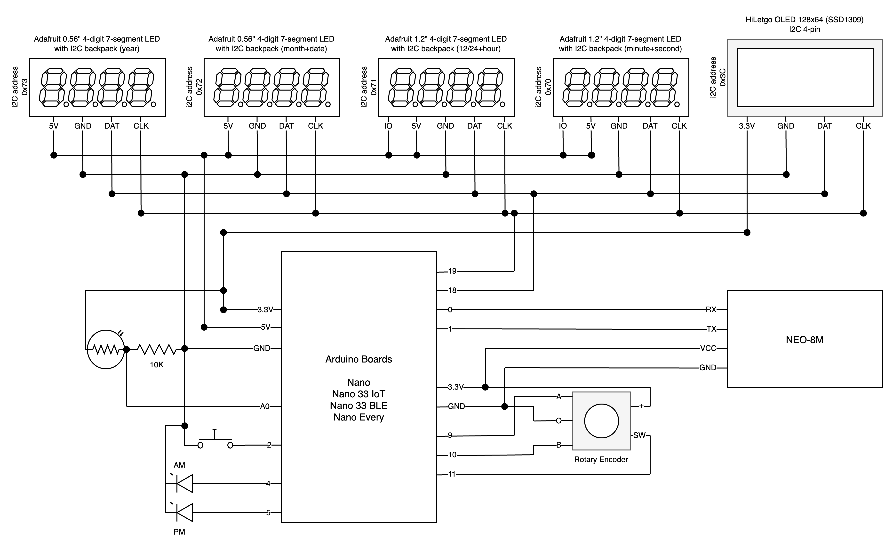
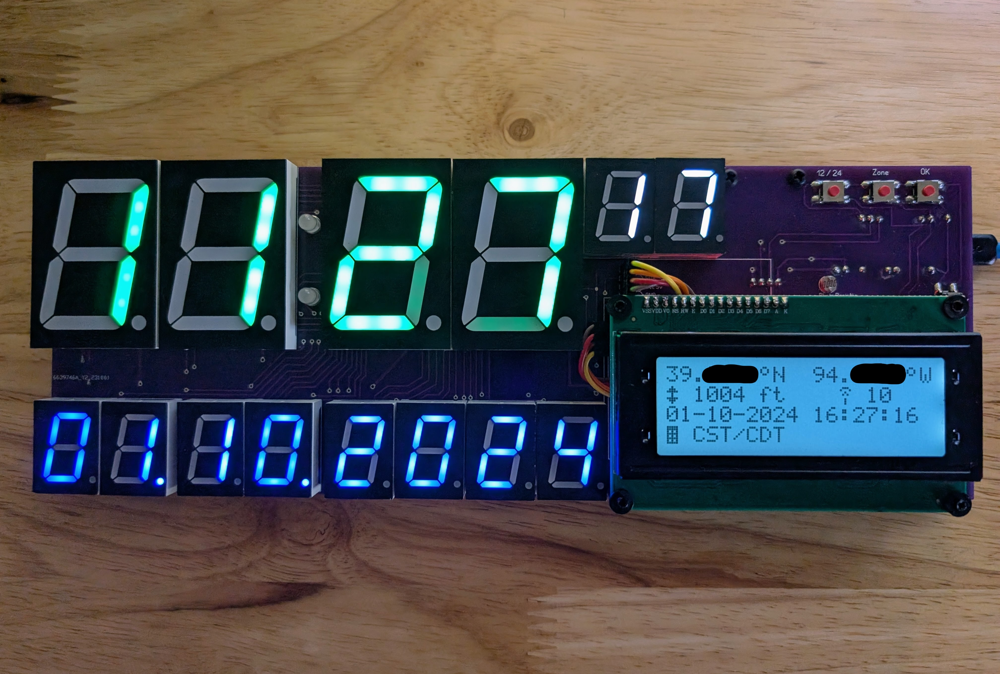

# GPS Clock

A GPS-synchronized digital clock based on the open-source [Arduino](https://arduino.cc) hardware platform.

* [Overview](#overview)
* [Hardware](#hardware)
  * [Generation 1](#hardware-generation-1)
  * [Generation 2](#hardware-generation-2)
  * [Generation 3](#hardware-generation-3)
  * [Generation 4](#hardware-generation-4)
  * [Generation 5](#hardware-generation-5)
* [Assembly](#assembly)
  * [Circuit Diagram](#circuit-diagram)
  * [LED Displays](#led-displays)
  * [LCD Display](#lcd-display)
  * [Rotary Encoder](#rotary-encoder)
  * [GPS Module](#gps-module)
* [Clock](#clock)
  * [Generation 1](#clock-generation-1)
  * [Generation 2](#clock-generation-2)
  * [Generation 3](#clock-generation-3)
  * [Generation 4](#clock-generation-4)
  * [Generation 5](#clock-generation-5)
  * [Other Clocks](#other-clocks)
* [Software](#software)
* [Contributing](#contributing)
* [License](#license)

## Overview

The COVID-19 lockdown rekindled a decades-long interest of mine in learning a bit more about electronics. Even though I was fascinated with the subject at a very early age, my interests gravitated towards software, and 40 years later, here I am clearing the cobwebs and delving into the study of electronics.

The best and most rewarding way to learn something new is to build something tangible and functional. This project is a culmination of my studies and hacking over a period of three months. It is a nontrival project in the sense that a variety of components are needed to build a digital clock that automatically sets the time and date based on GPS signals.

Bear with me if you happen to be a long-time Arduino hacker and developer, as this is my first serious project other than piecing things together with breadboards.

## Hardware

### Hardware Generation 1

https://github.com/davidledwards/gps-clock/tree/1.4

These are the components of the original clock design.

* [Arduino Uno R3](https://docs.arduino.cc/hardware/uno-rev3/) (1)
* [Adafruit Ultimate GPS Logger Shield](https://www.amazon.com/gp/product/B00E4WEX76) (1)
* [Adafruit 0.56" 4-Digit 7-Segment Display with I2C Backpack](https://www.amazon.com/gp/product/B00XW2L6SS) (3)
* [Adafruit Standard LCD 20x4](https://www.amazon.com/gp/product/B00SK69BZ6) (1)
* [Adafruit I2C LCD Backpack](https://www.amazon.com/gp/product/B00OKCON84) (1)
* [Adafruit Rotary Encoder](https://www.amazon.com/gp/product/B00SK8KK5Y) (1)
* [ElectroCookie Large Solderable PCB](https://www.amazon.com/gp/product/B07YBYZCTN) (1)
* [ElectroCookie Mini Solderable PCB](https://www.amazon.com/gp/product/B081MSKJJX) (1)

### Hardware Generation 2

https://github.com/davidledwards/gps-clock/tree/2.4

This generation of the clock included several refinements and improvements.

The time segment of the LED display was changed to green to create a visual distinction with the year/month/day LEDs, which turned out to be a nice usability improvement.

I decided to experiment with a photoresistor that is used to detect the ambient light level and adjust the brightness of the LED displays.

The mini PCB from generation 1 was eliminated since the rotary encoder was mounted directly on the GPS logger shield. There was also ample space on the GPS board to solder the photoresistor and pulldown resistor.

* [Arduino Uno R3](https://docs.arduino.cc/hardware/uno-rev3/) (1)
* [Adafruit Ultimate GPS Logger Shield](https://www.amazon.com/gp/product/B00E4WEX76) (1)
* [Adafruit 0.56" 4-Digit 7-Segment Display with I2C Backpack (white)](https://www.adafruit.com/product/1002) (2)
* [Adafruit 0.56" 4-Digit 7-Segment Display with I2C Backpack (green)](https://www.adafruit.com/product/880) (1)
* [JANSANE 20x4 LCD Display](https://www.amazon.com/gp/product/B07D7ZQVDR) (1)
* [Adafruit Rotary Encoder](https://www.amazon.com/gp/product/B00SK8KK5Y) (1)
* [ElectroCookie Large Solderable PCB](https://www.amazon.com/gp/product/B07YBYZCTN) (1)
* [Photoresistor](https://www.amazon.com/Photoresistor/s?k=Photoresistor) (1)
* [10K Ohm Resistor](https://www.amazon.com/10k-ohm-resistor/s?k=10k+ohm+resistor) (1)
* [220 Ohm Resistor](https://www.amazon.com/slp/220-ohm-resistor/pwc2jfx3cwoh9sf) (1)

### Hardware Generation 3

https://github.com/davidledwards/gps-clock/tree/3.4

This generation adds a push button to toggle between 12- and 24-hour formats. In 12-hour format, the LED display illuminates a dot on the lower-right edge of the time component. Additionally, it does not zero-pad the hour as seen in the 24-hour format. The goal was to make the format visually obvious to the observer without introducing any additional components.

The format is also stored in EEPROM, which means the clock will remember the last choice should it lose power.

* [Arduino Uno R3](https://docs.arduino.cc/hardware/uno-rev3/) (1)
* [Adafruit Ultimate GPS Logger Shield](https://www.amazon.com/gp/product/B00E4WEX76) (1)
* [Adafruit 0.56" 4-Digit 7-Segment Display with I2C Backpack (green)](https://www.adafruit.com/product/880) (2)
* [Adafruit 0.56" 4-Digit 7-Segment Display with I2C Backpack (blue)](https://www.adafruit.com/product/881) (1)
* [JANSANE 20x4 LCD Display](https://www.amazon.com/gp/product/B07D7ZQVDR) (1)
* [Adafruit Rotary Encoder](https://www.amazon.com/gp/product/B00SK8KK5Y) (1)
* [ElectroCookie Large Solderable PCB](https://www.amazon.com/gp/product/B07YBYZCTN) (1)
* [Photoresistor](https://www.amazon.com/Photoresistor/s?k=Photoresistor) (1)
* [10K Ohm Resistor](https://www.amazon.com/10k-ohm-resistor/s?k=10k+ohm+resistor) (1)
* [220 Ohm Resistor](https://www.amazon.com/slp/220-ohm-resistor/pwc2jfx3cwoh9sf) (1)
* [Tactile Button](https://www.adafruit.com/product/367) (1)

#### Generation 3 Software Update

I decided to move away from UTC offsets when selecting the timezone using the rotary encoder. Instead, the encoder now moves through a list of predefined timezones with daylight savings rules incorporated. The tradeoff is that given the constrained amount of RAM on the Uno board (2K), only a handful of timezones can be defined. Plans are in place to support the [Arduino Mega](https://docs.arduino.cc/hardware/mega-2560/) board which comes with 8K of RAM, thus allowing a larger set of timezones.

If you decide to clone the repository and modify the selectable timezones, be cautious when adding new entries. Use of too much RAM for global variables reduces the amount of available stack space. Overflowing stack space can result in all kinds of wonky behavior. Once support for the Mega board is announced, there should be plenty of space to define the most popular timezones around the globe.

A few other cosmetic improvements accompany this software update.

* In 12-hour mode, the dot on the LED to the right of the minute digit would be illuminated to give the user an indication that 12-hour mode was selected. This was necessary in order to distinguish between `10:32 PM` in 12-hour mode versus `10:32 AM` in 24-hour mode. However, it turns out that the dot only needs to be illuminated in 12-hour mode when the hour is PM, i.e. between 12:00 PM and 11:59 PM. This is also consistent with the behavior of most 12-hour clocks.
* When the rotary encoder is moved clockwise or counterclockwise to adjust timezone, the LCD display now provides a visual indicator showing that the timezone has changed but not yet committed (via pressing the button). The label on the LCD display shows `tz?` when selecting and `tz:` when committed. Additionally, the LED display is immediately updated to reflect the local time in the selected timezone. As previously supported, if the encoder detects no movement after 10 seconds, the selection is discarded and reverted back to the last committed timezone.

Internally, the GPS library was replaced with a smaller implementation requiring less memory. Originally, I had used the library built for the Adafruit GPS module, but all the bells and whistles were unnecessary. A generic library supporting the basic standard sentences that all GPS modules emit was sufficient. The upside was additional memory that could be used by the timezone database.

### Hardware Generation 4

https://github.com/davidledwards/gps-clock/tree/4.5

This generation comes with a handful of component changes as well as the addition of an extra LED display to show *seconds* as part of time. The clock construction looks significantly different than past generations.

The Arduino Uno board used in past generations has been replaced with the much smaller Arduino Nano board, which uses the same ATmega328 processor. It is also pin-compatible with the Uno, although the relative position of pins differs. Both boards have the same amount of RAM and flash memory.

The expensive Adafruit GPS shield was also replaced with a much more affordable and smaller NEO-6M GPS module. Moving to the Nano did away with the convenience of snapping the Adafruit GPS shield on top of the Uno, so it forced me to look at other options. The NEO-6M appears to work great at about 25% of the cost of the Adafruit GPS.

Another 4-digit LED display was introduced to show the current time with *seconds*. Both time-oriented LED displays were also upgraded from 0.56 inches to 1.2 inches.

[Arduino Mega](https://docs.arduino.cc/hardware/mega-2560/) is officially supported. Since the RAM (8K) is substantially larger than the Uno/Nano (2K), the number of timezones has been increased when Mega is the compilation target.

* [Arduino Nano](https://docs.arduino.cc/hardware/nano/) (1)
* [NEO-6M GPS Receiver](https://www.amazon.com/gp/product/B07P8YMVNT) (1)
* [Adafruit 0.56" 4-Digit 7-Segment Display with I2C Backpack (white)](https://www.adafruit.com/product/1002) (2)
* [Adafruit 1.2" 4-Digit 7-Segment Display with I2C Backpack (Red)](https://www.adafruit.com/product/1270) (2)
* [GeeekPi 20x4 LCD Display](https://www.amazon.com/gp/product/B086VVT4NH) (1)
* [WayinTop KY-040 Rotary Encoder](https://www.amazon.com/gp/product/B07T3672VK) (1)
* [Adafruit Half-Sized PCB](https://www.adafruit.com/product/1609) (1)
* [ElectroCookie Mini Solderable PCB](https://www.amazon.com/gp/product/B093VWBH4Q) (1)
* [Photoresistor](https://www.amazon.com/Photoresistor/s?k=Photoresistor) (1)
* [10K Ohm Resistor](https://www.amazon.com/10k-ohm-resistor/s?k=10k+ohm+resistor) (1)
* [Tactile Button](https://www.adafruit.com/product/367) (1)
* [Mini USB Cable](https://www.amazon.com/gp/product/B007NLW3C2) (1)

#### Generation 4 Software Update

The GPS library dependency was updated as a result of testing the use of a newer GPS module, [NEO-M8](https://www.u-blox.com/en/product/neo-m8-series), which is capable of locking on many more satellites. It turns out that this module emits sentences not recognized by [TinyGPS](https://github.com/mikalhart/TinyGPS). Fortunately, a newer library from the same developer, [TinyGPS++](https://github.com/mikalhart/TinyGPSPlus), is capable of parsing sentences from both NEO-M8 and NEO-6M modules. The impact on program storage space only increased by a few hundred bytes, which is still well below the `32K` limit on the Nano board.

### Hardware Generation 5

https://github.com/davidledwards/gps-clock/tree/5.2

This generation notably adds an OLED display as an alternative to the original LCD. Both _large_ (128x64) and _small_ (128x32) OLED displays are supported. The larger display adds more screen real estate, allowing more detailed GPS information to be shown. On the contrary, the smaller display has less screen real estate than the LCD, forcing some of the GPS information to be removed.

Note that the Arduino Uno and Arduino Nano boards do not work properly when the OLED configuration is used. Since both of these boards only espouse 2KB of SRAM, the combination of additional code and libraries will cause the stack to overflow and clobber the execution.

Several new Arduino Nano-series boards are now suppported. These include [Arduino Nano 33 IoT](https://docs.arduino.cc/hardware/nano-33-iot/), [Arduino Nano 33 BLE](https://docs.arduino.cc/hardware/nano-33-ble/), and [Arduino Nano Every](https://docs.arduino.cc/hardware/nano-every/). The OLED configuration works nicely with all of them.

The Arduino Nano 33 BLE board operates strictly at 3.3V, so the _photoresistor_ and _rotary encoder_ sensors must be attached to 3.3V (not 5V as depicted in the schematics). It turns out that the supported _GPS modules_ also operate correctly with 3.3V, though continued use of 5V appears to be safe.

AM and PM indicators were also introduced by way of default pins `4` and `5`, respectively. These pins are exclusively set `HIGH` and `LOW` if the clock is operating in 12-hour mode and the local time is AM and PM as one would expect. These presumably drive LEDs as illustrated in the schematic below.

New components:

* [OLED 2.42" 128x64 Display](https://www.amazon.com/HiLetgo-SSD1309-128x64-Display-Optional/dp/B0CFF3XNX4/?th=1)
* [OLED 0.91" 128x32 Display](https://www.amazon.com/gp/product/B08L7QW7SR/)
* [Arduino Nano 33 IoT](https://docs.arduino.cc/hardware/nano-33-iot/)
* [Arduino Nano 33 BLE](https://docs.arduino.cc/hardware/nano-33-ble/)
* [Arduino Nano Every](https://docs.arduino.cc/hardware/nano-every/)

#### Generation 5 Software Update

Several configuration additions and changes have been introduced, primarily to support the OLED display. See the section on [software](#software) for details.

* `BOARD_ARCH` is now used to specify the board architecture instead of assuming `avr`.
* `CONFIG_GPS_DISPLAY` specifies whether the LCD or OLED display is used.
* `CONFIG_MEASUREMENT_SYSTEM` specifies whether _imperial_ or _metric_ applies to the display of units.
* `CONFIG_USE_DOTS` will use _dots_ instead of _colons_ in the LED display.
* `CONFIG_OLED_I2C_ADDR` is used to configure the OLED display.
* `CONFIG_OLED_SIZE` specifies whether the OLED display is _large_ or _small_.
* `CONFIG_LCD_DRIVER` replaces `CONFIG_LCD_EXPANDER`, but is identical in function.
* `CONFIG_AM_PIN` and `CONFIG_PM_PIN` set exclusively high or low in 12-hour mode.

The LCD layout has been modernized to use glyphs that align with those shown on the OLED. Doing so opened up a bit of screen real estate, so altitude information is now displayed.

A new collection of predefined configurations has been created in the `configs/` folder. The naming convention is intuitive. These can be used as starting points for your own unique configuration of the clock.

## Assembly

### Circuit Diagram



### LED Displays

#### LED Displays Generation 1

Three 4-digit LED displays are used to show the local time in YYYY.MM.DD HH:MM format. The I2C backpacks are packaged unattached to the LED displays, which means they requiring soldering as part of the assembly process. The I2C backpacks are very convenient because they essentially need only two (2) pins on the Aurduino board for sending commands to the display. Furthermore, since I2C is a serial protocol that acts like a bus, multiple I2C-aware components can be attached to the same pins. However, they do require unique addresses, which will be discussed shortly.

These are the materials that ship with the 4-digit displays.


Solder the backpack to the display, but make sure it is not attached upside down. The *dots* are a convenient visual aid for aligning to the correct orientation. Solder four (4) of the pin headers to the top of the backpack. Repeat the same process for the remaining displays and backpacks.

This is a view of the assembled LED display for both sizes.


Once the LED displays have been assembled, each needs to be assigned a unique I2C address. This is accomplished by soldering jumpers on the underside of the backpack. There are three (3) jumpers that act like bits, so as one can imagine, there are 8 unique addresses. Each backpack comes with all three jumpers open, which is equivalent to address `0x70`. The `gpsconfig.h` file shows the address chosen for each LED display.

The LED displays are then arranged onto a larger PCB. The YYYY and MMDD displays are essentially touching each other while the HHMM has a small amount of space between its adjacent display. This was more of a design aesthetic than anything else.

This is a view of the LED displays attached to the PCB.


This is the wiring on the front side of the PCB before the LED displays were soldered. Wires from the power rail attach to pins on each display. And, the two pins representing the I2C bus are attached to each display in parallel.


Finally, this is the back of the PCB. Note that pin headers for power (+/-) and I2C were attached on both ends of the board. The reason for an additional set of headers is that they are being used to connect the LCD display, which is discussed later.


#### LED Displays Generation 4

A fourth LED display was introduced to support showing *seconds*, which meant splitting the time display into two separate 4-digit components. Also, both of these components were increased in size from 0.56 inches to 1.2 inches in order to achieve a new design aesthetic.

The first LED display (referred to as TIME_UPPER in the source code) shows a 12/24 hour indicator in the leftmost digit: in 12-hour mode, `A` for AM and `P` for PM; in 24-hour mode, `H` is always displayed. The second LED display (referred to as TIME_LOWER in the source code) shows minutes and seconds.


### LCD Display

#### LCD Display Generation 1

A single 20-column, 4-row LCD display is used to show GPS information and the currently selected timezone. The I2C backpack for the LCD was sold separately, but as mentioned above, is very convenient in reducing pin consumption on the Arduino board. The pins on the LED display simply connect to the LCD display.

This is a view of the front side of the LCD attached to the backpack.


And, this is a view of the back side of the LCD. Notice that I used the screw headers instead of pin headers. In retrospect, I would have soldered pin headers but did not want the hassle of removing the backpack and resoldering. Since the LCD display is operating on the same I2C pins, it requires an address that does not conflict with the LED displays (`0x70`, `0x71`, `0x72`). If you look closely, the `A0` and `A1` jumpers on the lower left of the backpack are soldered together, making the address of the LCD `0x73`.


#### LCD Display Generation 2

I decided to purchase a two-pack of the JANSANE 20x4 LCD displays instead of the Adafruit variant used in generation 1. It turns out that this introduced some complications in the source code because the JANSANE and Adafruit displays use different types of I/O expander chips.

The JANSANE uses a PCF8574T and the Adafruit uses a MCP23008. In short, this meant that the library needed to change as well as the I2C address. To further complicate, there are two variants of the JANSANE I/O expander, PCF8574T and PCF8574AT. The former defaults to the I2C address of `0x27` and the latter to `0x3F`. Because the PCF* chips use I2C addresses that do not conflict with the other Adafruit components, there was no need to solder jumpers on the backpack. The source code was modified to support conditional compilation depending on the type of I/O expander, which must be specified in the environment.

The JANSANE backpack attached to the LCD requires a jumper to enable the backlight. Rather than just close the circuit, I decided to use a 220 ohm resistor, which turned out to soften the display a bit.


### Rotary Encoder

#### Rotary Encoder Generation 1

The rotary encoder used in this project rotates infinitely in both directions with a nice mechanical pulse as it moves around. It also has a push button action. The encoder is used to select the timezone in 30-minute increments. For a variety of reasons, I kept the hardware and software simple with respect to timezone. Indeed, there are web services that will convert latitude/longitude to timezone, but this clock was designed to be self-contained and not rely on the presence of a wifi endpoint. The timezone offset is selected by rotating the encoder in either direction, but the selection is not committed until the encoder is pressed. Once committed, the local time shown in the LED display is modified accordingly. If a timezone is not selected, local time is always equivalent to UTC. The timezone is also stored in EEPROM so it can be recovered if the power source is interrupted.

As seen in this photo, the rotary encoder is mounted on a small PCB. It could also be mounted to a face plate.


This is a view of the back side of the PCB. Similar to other components, pin headers are used for making connections to the encoder.


#### Rotary Encoder Generation 2

The rotary encoder was mounted directly on the GPS board, which eliminated the need for a separate mini PCB.

#### Rotary Encoder Generation 4

The rotary encoder was upgraded to a version that came premounted on a small PCB with builtin pullup resistors.


### GPS Module

#### GPS Module Generation 1

The GPS module conveniently mounts directly on top of the Arduino Uno board. A set of pin headers need to be soldered to the GPS board, but once completed, both PCBs slide together nicely.


This is a view of the GPS module mounted to the Arduino. Notice the additional pin headers I soldered to the GPS board. These are the pins needed to connect the LEDs, LCD and rotary encoder.


This is a side view of the GPS mounted to the Arduino. You can see the pin headers for power and those used for the I2C serial bus (`A4`, `A5`).


This is the other side of the GPS. The visible pin headers (`9`, `10`, `11`) connect to the rotary encoder.


#### GPS Module Generation 2

The GPS board radically changed in this generation for two reasons. First, the rotary encoder was mounted directly on the GPS board. Second, the newly introduced photoresistor and its corresponding 10K ohm pulldown resistor were also soldered to the board. This simplified wiring and eliminated the mini PCB. It was also more aesthetically pleasing because the encoder was further recessed and less prominent when compared to generation 1.

The photoresistor is nearly invisible because of its size. It sits adjacent to the GPS receiver near its top-left corner. The pulldown resistor is located just below the photoresistor.


#### GPS Module Generation 3

The top of the GPS board was cleaned up in this generation by moving all wiring to the underside. The rotary encoder has been moved closer to the edge of the PCB to make room for the tactile button, which is used to toggle between 12- and 24-hour format.


#### GPS Module Generation 4

The original Adafruit GPS module was replaced with a much smaller and less expensive NEO-6M unit. Much of what precipitated the change was the original convenience of snapping the Adafruit module on top of the Uno board that went away when moving to the Nano.


The smaller form factor meant that soldering the rotary encoder, timezone switch and photoresistor was no longer an option. These were moved to a separate PCB where the GPS and Nano were also mounted. Instead of soldering the GPS and Nano directly to the board, I opted for pin headers to make replacement of these components easier.


The wires on the bottom area of the board connect to the rotary encoder and those on top connect to a separate PCB that allows all I2C devices to be attached in one place.

This is a view of the I2C bus with all LED and LCD components connected.


## Clock

### Clock Generation 1

This is a view of all components connected together and arranged into a final product. The use of pin headers made it very convenient to delay the majority of decisions about the layout of components in a box or similar structure. However, during the final assembly process, I had to eliminate some of the headers since they were obstructing other components. Also, notice how the rotary encoder is stacked on top of the GPS module.


This is an operating view of the clock with realtime GPS information displayed on the LCD. Once a satellite fix has been established, the LCD shows the latitude and longitude in decimal degrees format. It also displays the number of satellites for which a fix has been established and the UTC time. The selected timezone is also shown, but this is governed by the rotary encoder, not a data point from the GPS module.


### Clock Generation 2

The second generation turned out to be a slightly nicer design in the final assembly, primarily because the mini PCB was eliminated.


### Clock Generation 3

Very little changed in comparison to generation 2 except for moving wires to the underside of PCBs. This is also evident on the face of the clock in which prior generations had wires soldered on the front side.

The colors of the LEDs were also changed to green (year/month) and blue (time), but this was mainly due to personal taste.

The operating view below shows 12-hour format enabled.


### Clock Generation 4

This clock was designed to be mounted on the wall given the larger LEDs used for the time component. Notice the GPS antenna to the right and below the large LEDs. This is important to attach to the NEO-6M board otherwise the unit will have difficulty locking onto GPS signals. The PCB in the middle is essentially an I2C bus for all the display components.


The back side has rubber stoppers attached to the lower portion and a sawtooth hanger with spacers to match the depth created by the stoppers. This ensures that the clock hangs parallel to the wall as opposed to a slight angle.


Below is the unit with power attached. Notice the seconds in this new generation as well as the AM/PM/24 indicator on the far left of the large LEDs. The LCD works exactly the same as prior generations, though it is not illuminated in this photo.


### Clock Generation 5

The layout of the new large OLED display is shown below. Notably, the precision of _latitude_ and _longitude_ has improved because of additional screen real estate. Newly introduced glyphs, which should be intuitive, are shown on the left side of the display to identify the type of information. Also, _alitude_ is shown in either imperial or metric units depending on how the build was configured.


The following clock was configured to use _dots_ instead of _colons_ to separate hours, minutes, and seconds. The was necessary because smaller LED displays do not have left-most colons.


This photo shows the modernized LCD display using glyphs. Since the use of glyphs made additional screen real estate available, _altitude_ is now shown.


### Other Clocks

The clocks that follow were built by others inspired by this project. Proper attribution has been given unless the author requested anonymity.

#### Europe

This was a collaboration from someone in Europe that discovered the clock on GitHub in 2022. Some of the features in [generation 4](#hardware-generation-4), including support for additional hardware components, were inspired by ideas that emerged during our exchange. As seen below, much of the clock hardware was built from scratch.


This is a version of the clock above using a custom PCB that was sent by the collaborator in Europe. Much appreciated for his token of appreciation.

The following photos capture the front and back of the bare PCB.


These photos show the fully constructed and operational clock.




## Software

The [Arduino CLI](https://arduino.cc/pro/cli) is used for both compilation of source code and uploading of the binary to the actual board. I found this CLI preferrable over the [Arduino IDE](https://www.arduino.cc/en/main/software) because it allows the build and upload process to be fully described through the makefile. Simplicity of the development environment was essential. That said, if you prefer an IDE experience, I found the [Arduino for Visual Studio Code](https://marketplace.visualstudio.com/items?itemName=vsciot-vscode.vscode-arduino) extension to be much nicer than Arduino IDE.

Installs the Arduino core and dependent external libraries. This is an idempotent operation that first updates the library index and then ensures that all versioned dependencies are downloaded.

```sh
make install
```

Builds the sketch and its associated C++ files. The output directory of the build cannot be a subdirectory of the project, a restriction imposed by the Arduino compilation process, so it is placed under `TMPDIR`. However, the final program artifacts are written to the project directory.

```sh
make build
```

Uploads the program to the Arduino board. Make sure `PORT` is defined by the environment or provided as an argument to `make`.

```sh
make upload
```

```sh
make upload PORT=/dev/tty.usbmodem14401
```

Removes transient build files.

```sh
make clean
```

Generates predefined configuration files in the `configs/` subdirectory. The `config.h` file in the base directory is always generated from `.config` when `make build` is executed. All configuration variables have default values if undefined. Refer to the [configuration section](#configuration) for a description of variables evaluated during the process of generating `config.h`.

```shell
make config
```

Prints all configuration variables as detected by the execution environment. These variables are used to generate the configuration files when executing `make config` and `make build`. Please note that the configuration variables echoed by this command do not necessarily reflect what is contained in `config.h` unless `make build` has been executed.

```sh
make print
```

### Environment

Several environment variables affect the compilation process. Each of them have default values that may not necessarily reflect the hardware components being used, so please verify.

#### BOARD_ARCH

Supported board architectures:

* `avr`
  * Boards: `nano`, `uno`, `mega2560`
* `samd`
  * Boards: `nano_33_iot`
* `mbed_nano`
  * Boards: `nano33ble`
* `megaavr`
  * Boards: `nona4809`

Default is `avr`.

#### BOARD

Supported board types:

* `nano`  ← Arduino Nano
* `uno`  ← Arduino Uno R3
* `mega2560`  ← Arduino Mega 2560
* `nano_33_iot`  ← Arduino Nano 33 IoT
* `nano33ble`  ← Arduino Nano 33 BLE
* `nona4809`  ← Arduino Nano Every

Default is `nano`.

#### PORT

This is the serial port to which the Arduino board is attached. If undefined, it defaults to `/dev/null` and will cause an upload attempt to fail.

### Configuration

The compilation process is controlled by a number of configuration variables. A prerequisite for compilation is the creation of the `config.h` file, which is made convenient by using `make config`. A useful technique for discovering all possible configuration variables is done using `make print`.

While configuration variables can be defined in the shell environment or provided as arguments to `make`, the preferred approach is to use a `.config` file placed in the root directory. If present, it will be automatically imported into the makefile.

If access to the command line or use of `make` is not desired, create the `config.h` file by hand.

Example `.config` file.

```makefile
BOARD_ARCH = avr
BOARD = nano
CONFIG_DATE_FORMAT = EU
CONFIG_USE_SECONDS = 1
CONFIG_GPS_DISPLAY = LCD
CONFIG_LCD_DRIVER = MCP23008
CONFIG_MODE_PIN = 8
CONFIG_GPS_RX_PIN = 3
CONFIG_GPS_TX_PIN = 2
```

#### CONFIG_DATE_LAYOUT

Specifies the date layout, which is reflected in both the LCD and LED displays. Since the date spans two 4-digit LED displays, the vertical bars below represent the boundaries of the LEDs. Recognized options include:
* ISO
  * `|YYYY.|MM.DD|`

* EU
  * `|DD.MM.|YYYY|`

* US
  * `|MM.DD.|YYYY|`


Default is `ISO`.

#### CONFIG_LED_LAYOUT

Specifies the layout of the LED components. Since the time could span multiple 4-digit LED displays depending on configuration, the vertical bars below represent the boundaries of the LEDs. Recognized options include:

* NORMAL

  * This preferred layout reflects the [circuit design](#circuit-diagram).
  * when `CONFIG_USE_SECONDS` defined
    * when `CONFIG_USE_DOTS` not defined (default)
      * `|* HH|:MM:SS|`
    * when `CONFIG_USE_DOTS` defined
      * `|* HH.|MM.SS|`
    * where `*` is A/P/H to indicate AM/PM/24
  * when `CONFIG_USE_SECONDS` not defined
    * when `CONFIG_USE_DOTS` not defined (default)
      * `|HH:MM.|`
    * when `CONFIG_USE_DOTS` defined
      * `|HH.MM.|`
* ROMAN

  * This configuration was created for a specific construction of the clock that does not use the prescribed LED components.

  * when `CONFIG_USE_SECONDS` defined
    * `|HH|MM.|SS|`

  * when `CONFIG_USE_SECONDS` not defined
    * `|HH|MM.|`

Default value is `NORMAL`.

#### CONFIG_USE_SECONDS

Enables the use of *seconds* as part of the time display which was introduced in generation 4. Note that this option does directly change the configuration of LED displays and the corresponding I2C addresses, so please refer to the [circuit diagrams](#circuit-diagram).

#### CONFIG_USE_DOTS

Enables the use of _dots_ instead of colons to separate parts of the LED time display. Note that this option is ignored when the `CONFIG_LED_LAYOUT` is `ROMAN`.

#### CONFIG_LED_TIME_I2C_ADDR

I2C address of the time LED when `CONFIG_USE_SECONDS` is disabled. Default is `0x70`.

#### CONFIG_LED_TIME_LOWER_I2C_ADDR

I2C address of the low-order time LED when `CONFIG_USE_SECONDS` is enabled. Default is `0x70`.

#### CONFIG_LED_TIME_UPPER_I2C_ADDR

I2C address of the high-order time LED when `CONFIG_USE_SECONDS` is enabled. Default is `0x71`.

#### CONFIG_LED_MDAY_I2C_ADDR

I2C address of the month/day LED. If `CONFIG_USE_SECONDS` is enabled, default is `0x72` else `0x71`.

#### CONFIG_LED_YEAR_I2C_ADDR

I2C address of the year LED. If `CONFIG_USE_SECONDS` is enabled, default is `0x73` else `0x72`.

#### CONFIG_AM_PIN

Digital pin connected to `AM` indicator. This pin is set `HIGH` when the clock mode is 12-hour and the local time falls between 12:00 AM and 11:59 AM. Otherwise, the pin is set `LOW`.

Default is `4`.

#### CONFIG_PM_PIN

Digital pin connected to `PM` indicator. This pin is set `HIGH` when the clock mode is 12-hour and the local time falls between 12:00 PM and 11:59 PM. Otherwise, the pin is set `LOW`.

Default is `5`.

#### CONFIG_GPS_DISPLAY

Specifies the type of display used for GPS information. Recognized options include:

* LCD
* OLED

Default is `LCD`.

#### CONFIG_LCD_DRIVER

Specifies the type of driver attached to the LCD display. Recognized options include:

* PCF8574T
* PCF8574AT
* MCP23008

Default is `PCF8574T`.

#### CONFIG_LCD_I2C_ADDR

I2C address of the LCD display. The default value depends on `CONFIG_LCD_DRIVER`:

* PCF8574T = `0x27`
* PCF8574AT = `0x3F`
* MCP23008 = `0x73`

#### CONFIG_LCD_TYPE

Type of LCD display. The default value depends on `CONFIG_LCD_DRIVER`:

* PCF8574T = `GENERIC`
* PCF8574A = `GENERIC`
* MCP23008 = `ADAFRUIT`

#### CONFIG_OLED_I2C_ADDR

I2C address of the OLED display. Default is `0x3C`.

#### CONFIG_OLED_SIZE

Specifies the size of the OLED display. Recognized options include:

* `LARGE`
* `SMALL`

`LARGE` displays are 128x64, whereas `SMALL` are 128x32. Default is `LARGE`.

#### CONFIG_DIMMER_PIN

Analog pin connected to photoresistor used to adjust brightness of LED displays. Default is `0`.

#### CONFIG_MODE_PIN

Digital pin connected to 12/24-hour button switch. Default is `2`.

#### CONFIG_MODE_DEBOUNCE_MS

Debounce delay in milliseconds for 12/24-hour button switch. Default is `50`.

#### CONFIG_TZ_A_PIN

Digital pin connected to A lead of timezone rotary encoder. Default is `9`.

#### CONFIG_TZ_B_PIN

Digital pin connected to B lead of timezone rotary encoder. Default is `10`.

#### CONFIG_TZ_BUTTON_PIN

Digital pin connected to button lead of timezone rotary encoder. Default is `11`.

#### CONFIG_TZ_DEBOUNCE_MS

Debounce delay in milleseconds for timezone rotary encoder. Default is `5`.

#### CONFIG_TZ_ERROR_MS

Error correction delay in milliseconds for timezone rotary encoder. Default is `20`.

#### CONFIG_GPS_RX_PIN

Digital pin connected to RX lead of GPS module. Note that the RX pin of the GPS connects to the TX pin on the MCU.

The default value depends on `BOARD`:

* uno = `7`
* nano = `7`
* mega = `50`
* nano_33_iot = `0`
* nano33ble = `0`
* nona4809 = `0`

#### CONFIG_GPS_TX_PIN

Digital pin connected to TX lead of GPS module. Note that the TX pin of the GPS connects to the RX pin on the MCU.

The default value depends on `BOARD`:

* uno = `8`
* nano = `8`
* mega = `51`
* nano_33_iot = `1`
* nano33ble = `1`
* nona4809 = `1`

#### CONFIG_GPS_BAUD_RATE

Baud rate of GPS module. Default is `9600`.

#### CONFIG_AUTO_OFF_MS

Number of milliseconds of inactivity before the LCD backlight is turned off. Default is `30000`.

## Contributing

Please refer to the [contribution guidelines](CONTRIBUTING.md) when reporting bugs and suggesting improvements.

## License

Copyright 2021 David Edwards

Licensed under the Apache License, Version 2.0 (the "License"); you may not use this file except in compliance with the License. You may obtain a copy of the License at

<http://www.apache.org/licenses/LICENSE-2.0>

Unless required by applicable law or agreed to in writing, software distributed under the License is distributed on an "AS IS" BASIS, WITHOUT WARRANTIES OR CONDITIONS OF ANY KIND, either express or implied. See the License for the specific language governing permissions and limitations under the License.
